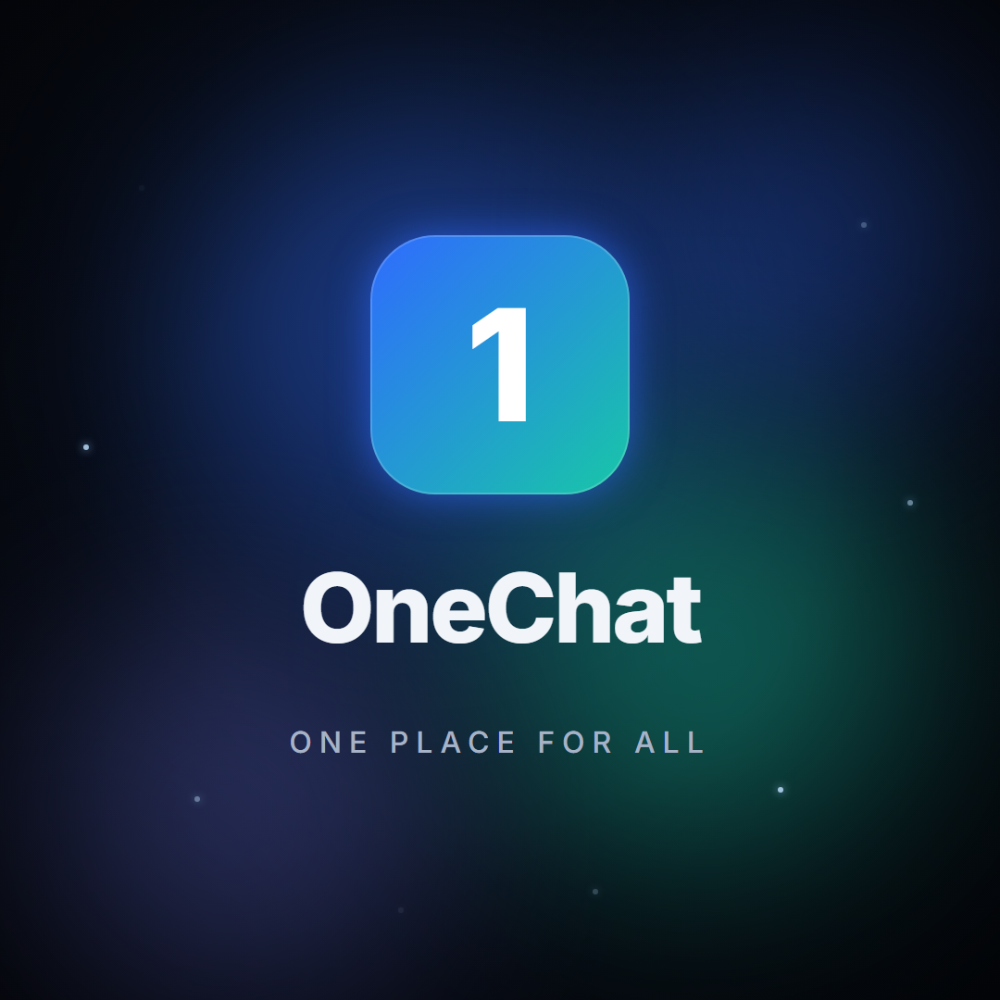

<div align="center">



# OneChat

**One place for all your messages — and an AI assistant that lives in them.**

A cross-platform communication **hub**: pool your real messaging accounts
(Telegram → Gmail → SMS) into one unified inbox, reachable from a sleek
always-on-top desktop **widget** that floats over your other apps.

</div>

---

## What it is

OneChat is a multi-tenant SaaS communication hub. People juggle the same
conversations across Telegram, Discord, Gmail, iMessage, and SMS — OneChat pools
them into **one inbox, one search bar**, with usability signifiers (a big
recipient "send-guard", consent-based smart-replace) drawn from an HCI study of
instant-messaging apps.

The flagship surface is a **desktop comm action bar**: a tiny ~3-icon launcher
snapped to the screen edge that expands into a compact glass hub — and collapses
back out of your way.

### Highlights
- 🪟 **Desktop widget** — frameless, always-on-top, Liquid-Glass overlay (`desktop/`, Electron)
- 📥 **Unified inbox** — one list + one search across every platform (`client/`, Expo)
- 🤖 **AI assistant** — summarize a thread / draft a reply, consent-based, latest Claude
- 🔌 **Connectors** — Telegram (GramJS) → Gmail (OAuth) → SMS, your own accounts only
- 🎬 **Brand motion** — Remotion logo intro + splash loader (`brand/`)

## Repo layout

| Path | What |
|------|------|
| `client/` | Expo (React Native) app — iOS / Android / web; the unified-inbox UI |
| `desktop/` | Electron desktop widget — the always-on-top comm action bar |
| `brand/` | Remotion brand videos (logo intro + splash loader) |
| `supabase/` | Postgres schema + RLS (the hosted backend) |
| `plans/` | Sprint-by-sprint build blueprint |

## Run it

```bash
# the app (web)
cd client && npx expo start --web        # http://localhost:8081

# the desktop widget (loads the app)
cd desktop && npm start                   # floats on your screen edge

# the brand videos
cd brand && npx remotion studio           # preview/edit
cd brand && npx remotion render OneChatIntro out/onechat-intro.mp4
```

## Status

Phase 0 (UI shell) done. Auth + per-user data isolation, the desktop widget, the
AI assistant, and the brand motion are in. Real message connectors and the live
hosted backend are the next sprints — see [`plans/onechat-hub-and-ai-build.md`](plans/onechat-hub-and-ai-build.md).

> Authorized use only — connect your own accounts; no ToS-violating scrapers.
